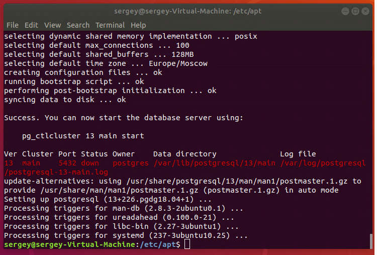
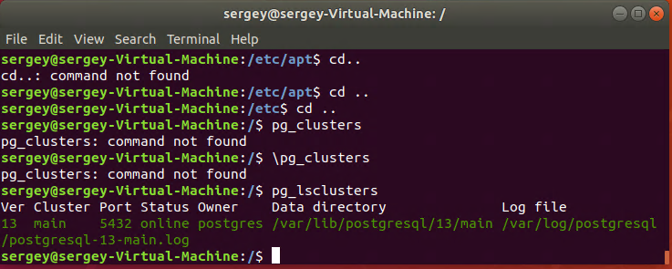
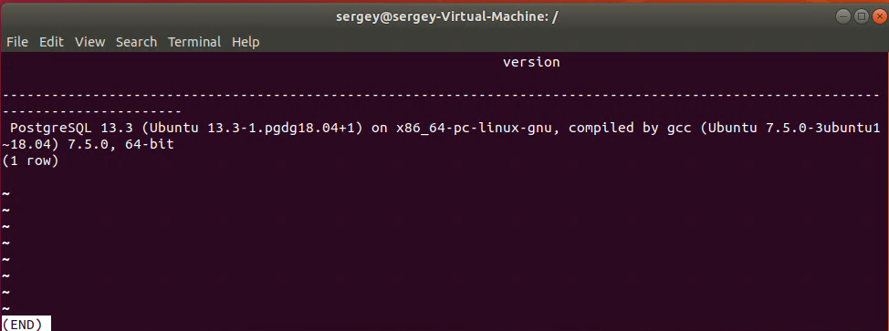
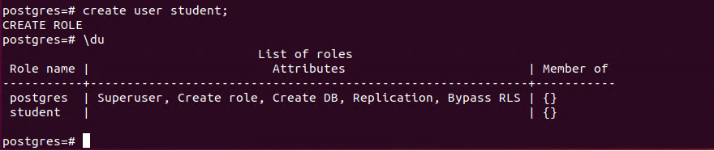
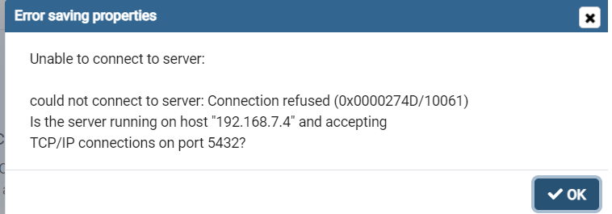

# Домашнее задание №6
- Создать кластер PostgreSQL в докере или на виртуальной машине, запустить сервер и подключить клиента

- Развернуть контейнер с PostgreSQL или установить СУБД на виртуальную машину.

- Запустить сервер.

- Создать клиента с подключением к базе данных postgres через командную строку.

- Подключиться к серверу используя pgAdmin или другое аналогичное приложение.

